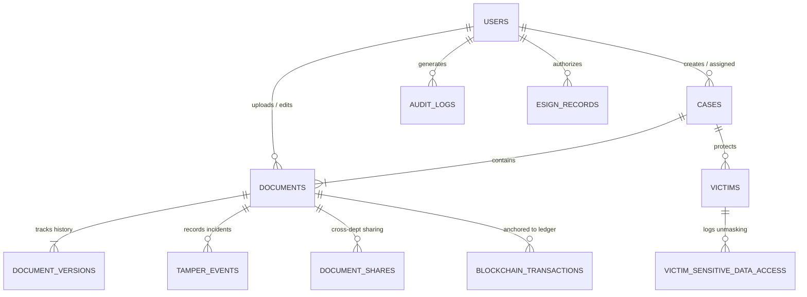

# JusticeVault Database Architecture & Schema Model

## Relational Entity-Relationship Diagram

## Data Dictionary & Key Security Constraints

### 1. `users`
- Primary key: `id` (e.g., `police.demo`)
- Passwords are salted using `PBKDF2-HMAC-SHA256` with 310,000 iterations.
- Identity holds X.509 MSP Organization tag (`PoliceHQ.Org1MSP`, `ForensicLab.Org2MSP`, `Judiciary.Org3MSP`).
- Role-based clearance levels: `L1` (Clerk) through `L6` (Principal Judge).

### 2. `cases`
- Unique identifier: `id` (e.g. `CASE-2026-001`) with official FIR index.
- Holds court jurisdiction, sealing flags, risk classifications.

### 3. `documents` & `document_versions`
- **Original Preservation Invariant**: When an authorized officer edits a document, `V1` is never overwritten. `V2` is stored as an independent record referencing `parent_hash = V1.hash`.
- `original_hash`: The SHA-256 fingerprint generated at first submission and verified against Hyperledger Fabric.
- `current_hash`: The latest active version's SHA-256 fingerprint.

### 4. `victims` & `victim_sensitive_data`
- `masked_payload`: Publicly safe zero-knowledge masked JSON representation (`Name: S•••••• K••••`).
- `encrypted_payload`: AES-256-GCM encrypted confidential PII envelope, accessible ONLY after step-up eSign authorization and clearance verification.

### 5. `tamper_events`
- Triggered whenever `calculatedHash !== trustedHash`.
- Quarantines the untrusted payload separately while preserving the authentic original evidence asset.

### 6. `blockchain_transactions`
- Anchors SHA-256 hashes, timestamps, signer identities, and Merkle tree block hashes on the Hyperledger Fabric channel `channel-legal-evidence`.
