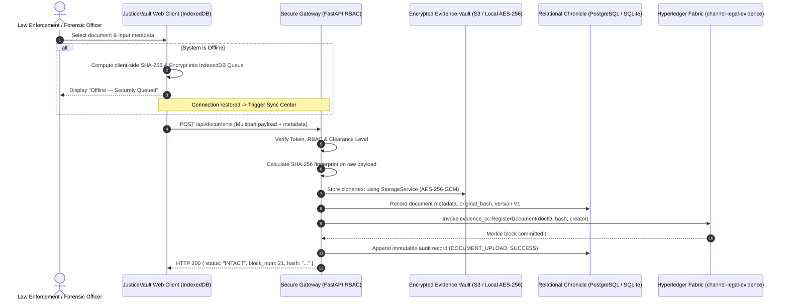
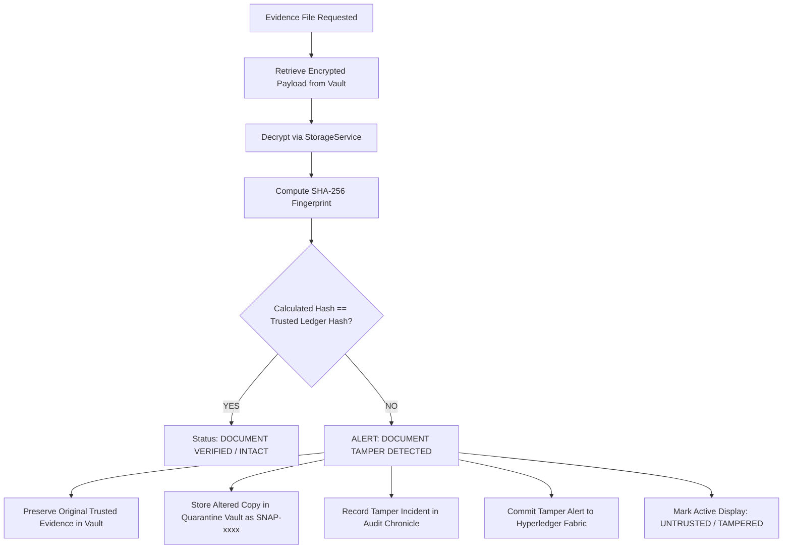

# JusticeVault Technical Architecture & Mind Map

**Platform**: JUSTICEVAULT — Secure Digital Evidence & Legal Document Trust Platform  
**Smart India Hackathon 2026** | **Problem Statement**: SIH26190 | **Team**: GenX

---

## 1. High-Level Mind Map

```
                             JUSTICEVAULT
                                  |
     -----------------------------------------------------------
     |            |             |               |              |
  IDENTITY     PRIVACY       DOCUMENT       INTEGRITY        AUDIT
     |            |             |               |              |
  Fabric CA    E-Sign        AES-256-GCM     SHA-256        Append-Only
  RBAC (L1-L6) PII Masking   Offline-First   Version Tree   Chronicle
  MSP Orgs     Step-Up Auth  Cloud Storage   Tamper Alert   Fabric Proof
```

---

## 2. End-to-End Cryptographic & Verification Flow



---

## 3. Version Control Invariant (Original-Preserving Architecture)

When an authorized user edits an existing investigation document:
1. **Original Version V1 is NEVER overwritten or mutated**.
2. A new version `V2` is created as an independent cryptographic entity.
3. Both versions are stored in the encrypted storage layer.
4. Database records:
   - `original_hash`: SHA-256 of V1
   - `current_hash`: SHA-256 of V2
   - `parent_hash`: Explicit cryptographic pointer from V2 to V1
   - `reason`: Justification for amendment entered by the officer.
5. Hyperledger Fabric registers `RegisterDocumentVersion` creating an immutable provenance chain: `V1 (Genesis) -> V2 (Amended) -> V3 (Reviewed)`.

---

## 4. Tamper Detection & Forensic Quarantine Protocol



---

## 5. Storage Abstraction (StorageService)

To ensure zero vendor lock-in, all evidence asset operations pass through the `StorageService` interface:
- `upload_encrypted_file(document_id, version, data, suffix)`
- `download_encrypted_file(relative_path)`
- `delete_or_archive_file(relative_path)`
- `get_file_metadata(relative_path)`
- `verify_file_hash(relative_path, expected_hash)`

Implementations provided:
1. `EncryptedLocalStorage`: Authenticated encryption at-rest for local rapid deployments.
2. `S3StorageAdapter`: Production-grade adapter connecting to AWS S3, MinIO, or National Informatics Centre (NIC) Government Cloud with zero code changes.
